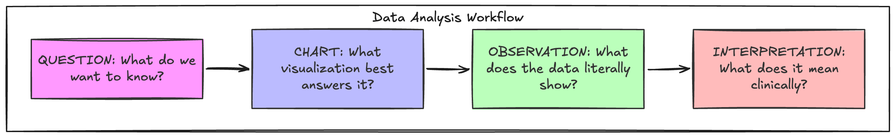
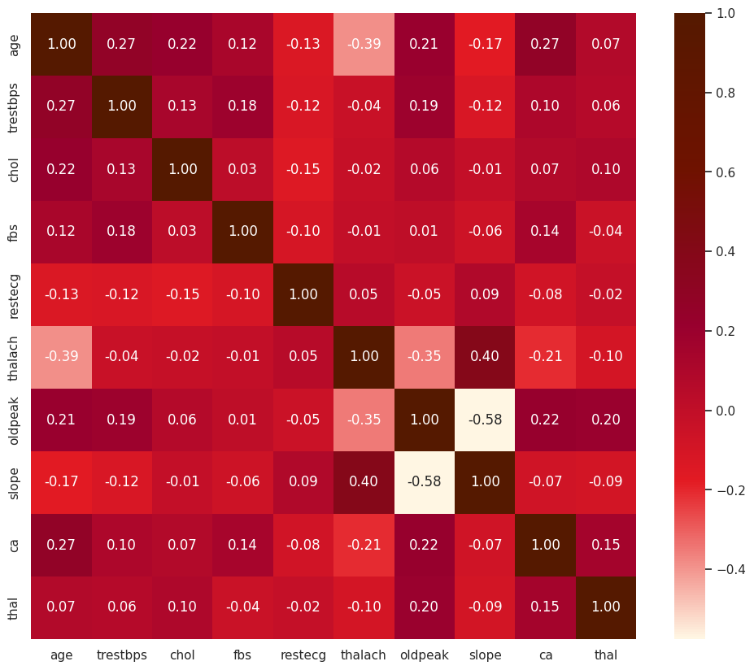
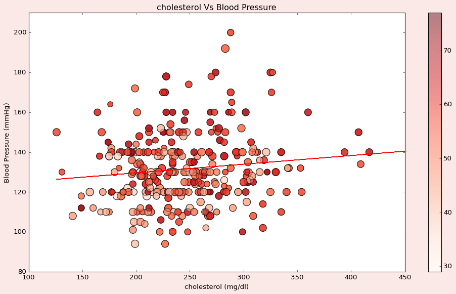

# ❤️ Heart Disease: Exploratory Data Analysis & Visualization

> **What patterns in patient characteristics are associated with heart-disease outcomes?**

---

## 📋 Table of Contents

- [Overview](#-overview)
- [Dataset](#-dataset)
- [Analytical Approach](#-analytical-approach)
- [Data Cleaning & Preparation](#-data-cleaning--preparation)
- [Questions Investigated](#-questions-investigated)
  - [Q1 — How does heart-disease prevalence vary with age?](#q1--how-does-heart-disease-prevalence-vary-with-age)
  - [Q2 — Are there differences across sex?](#q2--are-there-differences-across-sex)
  - [Q3 — Which variables show the strongest relationships with heart disease?](#q3--which-variables-show-the-strongest-relationships-with-heart-disease)
  - [Q4 — How do cholesterol and blood-pressure distributions differ between groups?](#q4--how-do-cholesterol-and-blood-pressure-distributions-differ-between-groups)
  - [Q5 — Which variables appear correlated, and what multivariate patterns emerge?](#q5--which-variables-appear-correlated-and-what-multivariate-patterns-emerge)
- [Final Conclusion](#-final-conclusion)
- [Skills Demonstrated](#-skills-demonstrated)
- [Tools & Technologies](#-tools--technologies)

---

## 🎯 Overview

Heart disease remains the leading cause of death globally. Early identification of at-risk patients through data-driven analysis can guide preventive care and improve outcomes. This project takes a **question-driven, investigative approach** to explore the UCI Heart Disease dataset — moving beyond simple chart-making to **extract meaningful clinical insights** through systematic exploratory data analysis.

Rather than producing visualizations in isolation, every chart in this analysis exists to **answer a specific question**, and every answer builds toward a coherent understanding of which patient characteristics are most closely tied to heart-disease diagnoses.

---

## 📊 Dataset

| Property | Detail |
|:--|:--|
| **Source** | UCI Machine Learning Repository — Heart Disease Dataset |
| **Records** | 1,025 patient observations |
| **Features** | 14 clinical and demographic variables |
| **Target** | Binary classification — `Heart Disease` vs. `No Heart Disease` |
| **Missing Values** | None (all 1,025 × 14 cells are non-null) |

### Feature Dictionary

| Feature | Description | Type |
|:--|:--|:--|
| `age` | Patient age in years | Continuous |
| `sex` | Sex (Male / Female) | Categorical |
| `cp` | Chest pain type (typical angina, atypical angina, non-anginal pain, asymptomatic) | Categorical |
| `trestbps` | Resting blood pressure (mm Hg) | Continuous |
| `chol` | Serum cholesterol (mg/dl) | Continuous |
| `fbs` | Fasting blood sugar > 120 mg/dl (1 = true, 0 = false) | Binary |
| `restecg` | Resting ECG results | Categorical |
| `thalach` | Maximum heart rate achieved during exercise | Continuous |
| `exang` | Exercise-induced angina (Yes / No) | Binary |
| `oldpeak` | ST depression induced by exercise relative to rest | Continuous |
| `slope` | Slope of peak exercise ST segment | Categorical |
| `ca` | Number of major vessels colored by fluoroscopy (0–4) | Discrete |
| `thal` | Thalassemia result | Categorical |
| `target` | Diagnosis — Heart Disease / No Heart Disease | Binary |

---

## 🧭 Analytical Approach

This analysis follows a structured **investigative framework**. Each question is answered through a repeating cycle:

<p align="center">
  
</p>

This approach mirrors how a data analyst works in practice — starting with curiosity, selecting the right tool, reading the evidence, and communicating the insight.

---

## 🧹 Data Cleaning & Preparation

Before any analysis, the raw dataset required transformation to make it interpretable and visualization-ready:

```python
# Decode numeric codes into human-readable labels
heart['sex']    = heart['sex'].replace({1: 'Male', 0: 'Female'})
heart['cp']     = heart['cp'].replace({
    0: 'typical angina', 1: 'atypical angina',
    2: 'non-anginal pain', 3: 'asymptomatic'
})
heart['exang']  = heart['exang'].replace({1: 'Yes', 0: 'No'})
heart['target'] = heart['target'].replace({
    1: 'Heart Disease', 0: 'No Heart Disease'
})
```

**Why this matters:** Raw datasets often encode categorical variables as integers for storage efficiency. Without decoding, every visualization label would show cryptic `0` / `1` / `2` / `3` values — making charts unreadable to stakeholders. This step transforms the data from *machine-readable* to *human-readable* without losing information.

**Data quality check:**
- ✅ Zero null values across all 14 columns
- ✅ Consistent dtypes after transformation
- ✅ No duplicate-removal needed for this analysis
- ✅ Subsets created for targeted analysis: `HeartDisease` and `NoHeartDisease` DataFrames

---

## 🔎 Questions Investigated

---

### Q1 — How does heart-disease prevalence vary with age?

> *If age is a risk factor, we'd expect to see heart-disease cases concentrate in older age brackets. Let's test that assumption.*

#### Stacked Histogram — Heart Disease Prevalence by Age Group


**Observation**
Heart-disease cases (red) are **most concentrated in the 40–65 age range**, with the peak volume occurring around ages 55–60. Below age 35, cases are extremely rare. The ratio of heart disease to no heart disease shifts dramatically: in younger groups, the dark bars (no disease) dominate, while in the 50–60 range, the red (disease) segment grows to roughly **60–65%** of the total bar height.

**Interpretation**
Age is clearly associated with heart-disease prevalence — but the relationship is not purely linear. There appears to be a **critical inflection point around age 40–45** where risk begins escalating sharply. This aligns with established cardiovascular medicine, where middle age marks the onset of cumulative arterial damage. Notably, very elderly patients (75+) show fewer total cases — likely a **survivorship bias** in the dataset rather than reduced risk.

#### Detailed Age Breakdown — Count per Year


**Observation**
This granular view reveals that **age 58 is the single most represented age** in the dataset (44 heart disease + 31 no heart disease = 75 patients), followed by ages 54 and 52. Heart disease counts consistently **exceed or match** no-heart-disease counts for nearly every age between 41 and 64.

**Interpretation**
The year-by-year breakdown confirms the histogram pattern with more precision. The concentration of cases in the late 40s–early 60s makes age an essential variable for any downstream risk model. A data analyst building a patient risk dashboard should flag patients entering their 40s for enhanced cardiovascular monitoring.

---

### Q2 — Are there differences across sex?

> *Heart disease is often framed as a "male disease." Does the data support this, or is the picture more nuanced?*

#### Count Plot — Heart Disease by Gender


**Observation**
Males in the dataset outnumber females roughly **2.3:1** (≈710 males vs. ≈310 females). Among males, the split is approximately **410 no-disease vs. 300 disease** (≈42% prevalence). Among females, it's approximately **85 no-disease vs. 225 disease** (≈73% prevalence).

**Interpretation**
This is a critical finding that challenges surface-level assumptions. While **more males have heart disease in absolute numbers**, the **prevalence rate among females is substantially higher** (73% vs. 42%). This suggests that when women in this dataset do present for cardiac evaluation, they are far more likely to receive a positive diagnosis. Two possible explanations:

1. **Selection bias** — women may only be referred for cardiac testing when symptoms are more severe, inflating the positive rate.
2. **Genuine biological risk** — the female patients in this cohort may carry heavier risk factor burdens by the time they are tested.

Either way, this underscores that **sex must be included as a stratification variable** in any analysis — and that raw count comparisons without normalization can be misleading.

#### Age vs. Blood Pressure by Sex — Regression Trends


**Observation**
Both males and females show a **positive linear trend** between age and resting blood pressure. The regression lines are nearly parallel, with females tracking slightly higher on average in the 50–70 age range. Variance around the regression is high for both groups, indicating that age alone is a weak predictor of blood pressure.

**Interpretation**
While blood pressure rises with age regardless of sex, the similar slopes suggest that **the rate of age-related BP increase is comparable between sexes**. The high scatter confirms that other factors (genetics, lifestyle, medication) are at play. This motivates the multivariate analysis in Q5.

---

### Q3 — Which variables show the strongest relationships with heart disease?

> *With 13 features available, which ones actually matter? A correlation matrix is the fastest way to identify signal from noise.*

#### Correlation Heatmap — All Numeric Variables



**Observation**
The heatmap reveals several notable correlations:

| Variable Pair | Correlation | Direction |
|:--|:--|:--|
| `age` ↔ `thalach` | **-0.39** | Strong negative |
| `oldpeak` ↔ `slope` | **-0.58** | Strong negative |
| `oldpeak` ↔ `thalach` | **-0.35** | Moderate negative |
| `thalach` ↔ `slope` | **+0.40** | Moderate positive |
| `age` ↔ `trestbps` | **+0.27** | Weak positive |
| `age` ↔ `ca` | **+0.27** | Weak positive |
| `age` ↔ `chol` | **+0.22** | Weak positive |

Most other pairs show correlations near zero, indicating weak or no linear relationship.

**Interpretation**
The strongest signal in the data is the **inverse relationship between age and maximum heart rate** (r = -0.39): as patients age, their achievable heart rate during exercise declines. This is physiologically well-established (the classic formula *220 − age* estimates max heart rate).

The `oldpeak`–`slope`–`thalach` cluster forms a **physiological triangle**: exercise-induced ST depression (`oldpeak`) is linked to lower achievable heart rates and different ST-segment slopes — all of which are markers of cardiac stress response. These three variables likely carry the most discriminative power for predicting heart disease.

Notably, `chol` (cholesterol) shows **surprisingly weak correlations** with most other variables (including the target), suggesting that cholesterol alone — despite its reputation — may not be the strongest predictor in this dataset.

#### Max Heart Rate vs. Age — With Theoretical Normal Line


**Observation**
For **both males and females**, patients diagnosed with heart disease (orange dashed line) consistently achieve **higher maximum heart rates** than their no-disease counterparts (blue solid line) at the same age. The theoretical normal max heart rate (red dashed line, calculated as 220 − age) serves as a ceiling reference. Heart-disease patients track closer to this ceiling, while no-disease patients fall further below it.

**Interpretation**
This is a **counterintuitive finding** that requires careful interpretation. One might expect diseased hearts to perform *worse* during exercise. However, in the context of this dataset's target encoding, patients labeled "Heart Disease" may have been specifically diagnosed because they showed **abnormal cardiac responses during stress testing** — and the elevated thalach values may reflect compensatory mechanisms or different symptom presentation patterns. This reinforces that `thalach` is a critical diagnostic variable that interacts with age and sex in complex ways.

---

### Q4 — How do cholesterol and blood-pressure distributions differ between groups?

> *Traditional risk factors like cholesterol and blood pressure are the pillars of cardiovascular risk assessment. Let's see if the data agrees.*

#### Cholesterol vs. Blood Pressure — Scatter with Regression



**Observation**
The scatter plot shows cholesterol (x-axis) against resting blood pressure (y-axis), with point color encoding age and point size encoding max heart rate. The regression line has a **near-flat positive slope**, indicating a very weak linear relationship. Most patients cluster in the **200–300 mg/dl cholesterol** and **110–150 mmHg blood pressure** ranges. Outliers exist above 400 mg/dl cholesterol and above 180 mmHg blood pressure, but they are sparse.

**Interpretation**
Contrary to popular expectation, **cholesterol and blood pressure are only weakly correlated** in this dataset (r ≈ 0.13). High cholesterol does not reliably predict high blood pressure, and vice versa. This suggests these are **independent risk pathways** — a patient could have dangerous cholesterol with normal blood pressure, or elevated blood pressure with normal cholesterol. Risk assessment tools must treat them as separate dimensions, not redundant signals.

#### Age vs. Cholesterol — Hexbin Density


**Observation**
The hexbin density map shows that the **highest concentration of patients** falls in the 45–60 age range with cholesterol levels between 200–280 mg/dl. The cholesterol distribution is roughly **right-skewed**, with a long tail extending to 400+ mg/dl. The marginal histograms confirm that both age and cholesterol peak in their respective mid-ranges.

**Interpretation**
The density clustering in the 200–280 mg/dl cholesterol band is clinically significant — this range straddles the boundary between "desirable" (<200) and "borderline high" (200–239) cholesterol. Many patients in this dataset fall in a **grey zone** where clinical decisions are ambiguous, making data-driven risk scoring particularly valuable.

#### Blood Pressure vs. Heart Rate — Faceted by Sex & Chest Pain Type


**Observation**
This faceted view breaks down blood pressure vs. max heart rate by **sex (rows)** and **chest pain type (columns)**, colored by heart disease status. Key patterns:
- **Typical angina** shows the densest population, with substantial overlap between disease and no-disease groups.
- **Asymptomatic** patients (last column) are notably **sparse among females** — only a handful of observations.
- Heart-disease patients (orange) tend to cluster at **higher thalach values** across most facets.

**Interpretation**
The faceted structure reveals that the relationship between hemodynamic variables (BP, heart rate) and heart disease is **modulated by both sex and symptom presentation**. A one-size-fits-all threshold would miss important subgroup differences. This supports a **stratified analytical approach** where models are either trained separately per subgroup or include interaction terms.

---

### Q5 — Which variables appear correlated, and what multivariate patterns emerge?

> *Univariate and bivariate analyses have limits. Now let's look at how variables interact simultaneously.*

#### Age vs. ST Depression (Oldpeak) — KDE by Sex


**Observation**
The kernel density estimate reveals distinct distributions for males (blue) and females (orange):
- **Males** show a broader distribution with density extending to higher `oldpeak` values (up to 4–5), particularly in the 50–70 age range.
- **Females** concentrate more tightly with a **strong density peak near oldpeak = 0** and age 50–60.
- An outlier point for males appears near age 55, oldpeak ≈ 6.

**Interpretation**
The sex-stratified KDE confirms that **ST depression during exercise manifests differently between sexes**. Males show a wider range of oldpeak values — suggesting more varied cardiac stress responses — while females tend toward minimal ST depression. This could indicate different pathophysiological mechanisms or diagnostic thresholds. For a predictive model, `oldpeak` and `sex` should be considered as an **interacting pair**, not independent features.

#### Age vs. Max Heart Rate — Joint Distribution by Heart Disease Status


**Observation**
The joint histogram reveals two visually separable clusters:
- **Heart Disease patients** (blue) dominate the **upper-left quadrant** — younger age, higher max heart rate.
- **No Heart Disease patients** (red) dominate the **lower-right quadrant** — older age, lower max heart rate.
- The marginal distributions on the axes confirm: heart disease patients skew **younger** and achieve **higher thalach values**.

**Interpretation**
This joint distribution is arguably the **most important single visualization** in the analysis. It shows that `age` and `thalach` together create a **natural decision boundary** — the two groups are partially separable in this 2D space. A simple classifier could exploit this structure: patients who are younger but achieve abnormally high heart rates during stress testing may warrant further investigation. This finding is consistent with the correlation matrix (Q3), where `age` and `thalach` had the dataset's strongest pairwise correlation.

#### Chest Pain Type × Exercise Angina — Multivariate Scatter for Heart Disease Patients


**Observation**
Among heart-disease patients only, this faceted scatter (age vs. resting BP, sized by thalach, colored by exercise angina) shows:
- **Typical angina** has the most patients, with exercise-induced angina (red ✕) scattered across all age-BP combinations.
- **Atypical angina** and **non-anginal pain** show dense clustering in the 120–140 mmHg BP range.
- **Asymptomatic** patients are few but notable — their presence among diagnosed heart-disease patients underscores the danger of relying on symptoms alone.

**Interpretation**
The asymptomatic subgroup is the most clinically alarming. These patients **have heart disease but report no chest pain** — exactly the type of patient who might be missed by symptom-based screening. Data-driven risk scores using the objective measurements in this dataset (BP, heart rate, ST depression) could catch what symptoms alone cannot.

---

## 🏁 Final Conclusion

This investigation set out to answer: **What patterns in patient characteristics are associated with heart-disease outcomes?**

After systematically examining five sub-questions, the evidence converges on several key findings:

### Key Findings

| # | Finding | Strength of Evidence |
|:--|:--|:--|
| 1 | **Age is a primary risk axis**, with a critical inflection around 40–45 years | Strong — consistent across histograms, regression, and joint plots |
| 2 | **Sex modulates risk presentation**: females show higher prevalence rates but different physiological patterns (lower oldpeak, different thalach distributions) | Strong — visible in count plots, KDE, and faceted analysis |
| 3 | **Max heart rate (thalach) and ST depression (oldpeak)** are the most discriminative continuous variables | Strong — highest correlations in heatmap; visually separable in joint plot |
| 4 | **Cholesterol is a weaker predictor than expected** — its correlation with other risk factors is low | Moderate — supported by correlation matrix and scatter analysis |
| 5 | **Chest pain type creates meaningful subgroups** — especially the asymptomatic group, which represents a hidden-risk population | Moderate — visible in faceted analysis but limited by small sample sizes |
| 6 | **Blood pressure and cholesterol are independent risk pathways** — high in one does not predict high in the other | Moderate — flat regression line, low correlation |

### What This Means

A data-driven approach to heart disease risk assessment should:
- **Prioritize `thalach`, `oldpeak`, `age`, and `cp`** as top features
- **Stratify by sex** rather than treating sex as a simple binary covariate
- **Not over-rely on cholesterol** as a standalone indicator
- **Pay special attention to asymptomatic patients** who may be missed by symptom-based screening

These insights lay the groundwork for a future predictive model — but the EDA itself demonstrates that **careful analysis and interpretation** can yield actionable clinical understanding before a single model is trained.

---

## ✅ Skills Demonstrated

| Skill | How It Was Applied |
|:--|:--|
| ✓ **Data Cleaning** | Decoded numeric categorical variables into human-readable labels; created analytical subsets |
| ✓ **Exploratory Data Analysis** | Structured investigation around 5 research questions with systematic hypothesis testing |
| ✓ **Distribution Analysis** | Histograms, KDE plots, hexbin density maps to characterize variable distributions |
| ✓ **Correlation Analysis** | Custom-styled heatmap to identify feature relationships; distinguished strong vs. weak signals |
| ✓ **Visualization** | 15+ charts across 6 libraries (Matplotlib, Seaborn, Altair, Plotly); regression lines, faceted grids, joint plots |
| ✓ **Insight Communication** | Every chart paired with written Observation + Interpretation; findings synthesized into actionable conclusions |
| ✓ **Python / Pandas** | End-to-end data pipeline: loading, cleaning, transforming, analyzing, visualizing |
| ✓ **Critical Thinking** | Identified counterintuitive patterns (e.g., female prevalence, thalach direction); flagged potential biases |

---

## 🛠 Tools & Technologies

| Tool | Purpose |
|:--|:--|
| **Python 3** | Core programming language |
| **Pandas** | Data manipulation and cleaning |
| **NumPy** | Numerical computations, regression fitting |
| **Matplotlib** | Static visualizations, custom styling |
| **Seaborn** | Statistical plots (heatmaps, jointplots, relplots, KDE) |
| **Altair** | Interactive, declarative visualizations |
| **Plotly Express** | Animated, interactive scatter plots |
| **Google Colab** | Cloud-based notebook environment |

---

<p align="center"><em>📌 This analysis is an exploratory investigation, not a predictive model. All interpretations are observational and should be validated with domain expertise and formal statistical testing before clinical application.</em></p>
